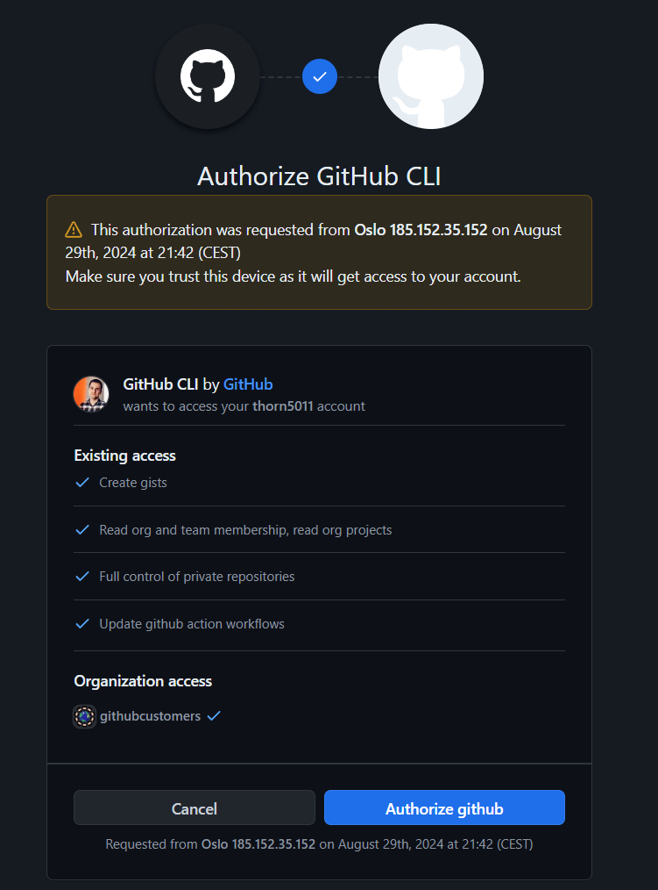

Each time I setup a new box, be it a new installation of a Raspberry or be it a fresh VM, I need to google a bunch to times to grab commands and a new GitHub dev key to authenticate. Well, this time I'll try to document the process so new time might be slightly less painstaking. Let's get started!

# Tools needed

- [`gh`](https://github.com/cli/cli?tab=readme-ov-file#linux--bsd) - use one-liner to install with `apt`. This is **not** the same as `git` which is an easy mistake for us n00bs to make. 
- [`git`](https://git-scm.com/book/en/v2/Getting-Started-Installing-Git) - often pre-installed on Debian-based distributions, like with Raspbian.

# How to login with gh

1. Paste `BROWSER=false gh auth login` (since I want to access GitHub from my desktop and not the Pi, I'll use `BROWSER=false`)
   
2. Access [https://github.com/login/device](https://github.com/login/device) from desktop
3. Use the one-time code
4. Allow access and verify with MFA

1. Success!


But wait, what was that, "..credentials saved in **plain text**"? Perhaps that is not a surprise once we consider how any authentication schema work but I like that it is clearly stated in this case.

Here is the culprit -> `cat $HOME/.config/gh/hosts.yml`
```sh
github.com:
    users:
        thorn5011:
            oauth_token: gho_TOKEN
    git_protocol: https
    user: thorn5011
    oauth_token: gho_TOKEN
```


# Results

Clone wit ease by using `gh repo clone thorn5011/repo_name`. Now I can continue to clone, push, pull and use all those wonderful actions without the need to re-authenticate! 

```sh
$ git add lol123
$ git push
Username for 'https://github.com':
```
***record scratch*** wait what?! Remeber how `gh` and `git` ain't the same? Ahh, yes..

- `GitHub`: a web-based platform for hosting a collaborating. Owned by Microsoft
- `Git`: an open-source tool for version control owned by the Linux foundation and developed by the G.O.A.T. Linus Torvalds.

That means `gh` is a tool to interact with GitHub, while `git` can be used to interact with many other vendors as long as the support git for version control. BUT we can actually use gh to help use setup git; `gh auth git-setup` {:height="36px" width="36px"}


# Conclusion

We can use `gh` for cloning repos, creating issues, PR etc. For pushing and pulling we still need `git`. But what is really good is that we can use gh to set up git with:

`gh auth git-setup`