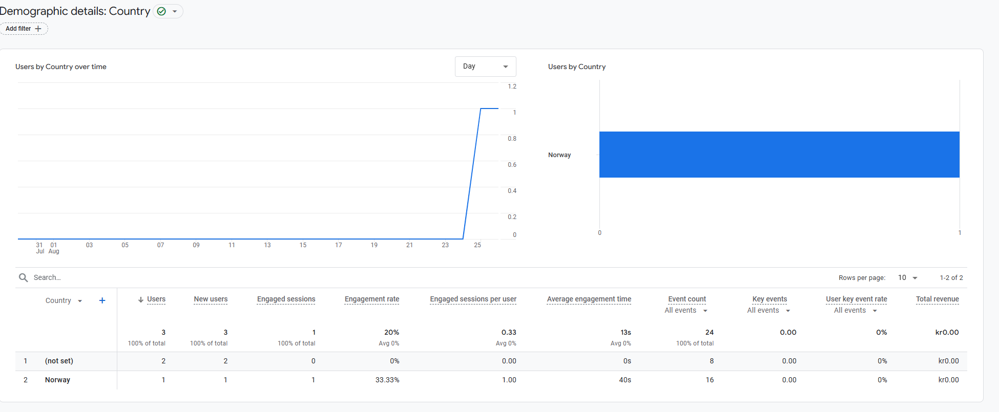
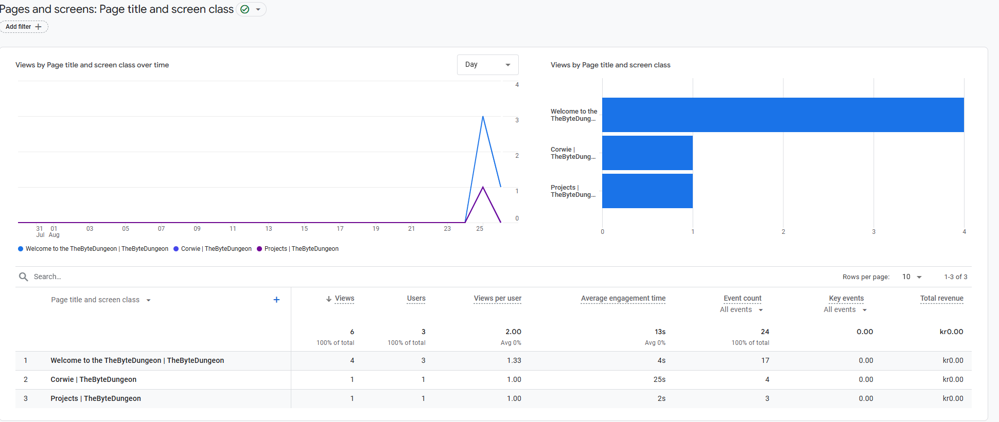
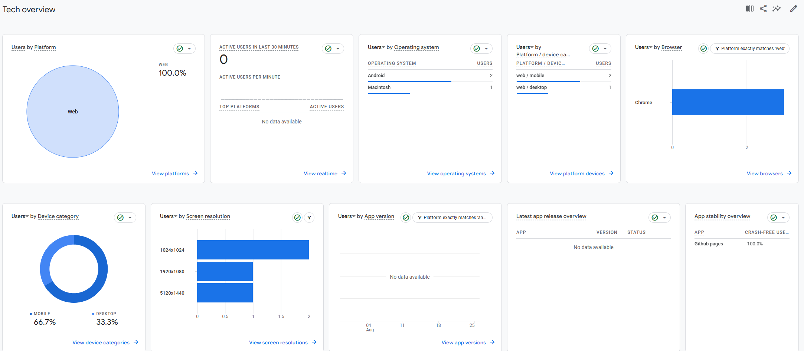

I've always been curious how much data appears on Google Analytics and especially what conclusion Google makes from it (if any).

# :bar_chart: Getting started

Enabling analytics on a site is very easy. All we have to do is to create a "company" and and by including a bit of javascript code we are good to go:

```html
<!-- Google tag (gtag.js) -->
<script async src="https://www.googletagmanager.com/gtag/js?id=G-T096ZRKQHL"></script>
<script>
  window.dataLayer = window.dataLayer || [];
  function gtag(){dataLayer.push(arguments);}
  gtag('js', new Date());

  gtag('config', 'G-T096ZRKQHL');
</script>
```

`T096ZRKQHL` is my unique ID, which will connect any readers to my Google "company". This is assuming the reader does not block javascript or blocks trackers.:v:

# Preventing data from being sent to Google analytics

There are a number of possibilites, some of them include:
- Apparently Google have made a [tool to prevent tracking](https://tools.google.com/dlpage/gaoptout).
- Blocking Javascript like with [`NoScript`](https://noscript.net/)
- Ad-blockers like [`uBlock`](https://ublockorigin.com/)
- DNS blockers like a [`PiHole`](https://pi-hole.net/)
- I would have thought that the "Do not track" setting would be honored, but I am probably naive. Stated on [support.google.com](https://support.google.com/chrome/answer/2790761) they tell us this:
  > Most websites and web services, including Google's, don't change their behavior when they receive a Do Not Track request
  
  ChatGPT also agrees:
  > Most websites and services, including Google Analytics, do not honor the DNT signal by default. Compliance with DNT is voluntary, and many websites choose to ignore it.


# What happens in the background?

Looking at the `https://www.googletagmanager.com/gtag/js?id=G-T096ZRKQHL` URL which users access, it load a javascript file:

```sh
$ wc -l js\?id=G-T096ZRKQHL
779 js?id=G-T096ZRKQHL
# 
$ wc -c js\?id=G-T096ZRKQHL
315180 js?id=G-T096ZRKQHL
```
315k characters :tada:

[support.google.co](https://support.google.com/analytics/answer/12159447?hl=en) tells us what they are doing:
> Every time a user visits a webpage, the tracking code will collect **pseudonymous information about how that user interacted with the page**.
> The measurement code will also collect information from the browser like the language setting, the type of browser (such as Chrome or Safari), and the device and operating system on which the browser is running. It can even collect the “traffic source,” which is what brought users to the site in the first place. This might be a search engine, an advertisement they clicked on, or an email marketing campaign.

## Wait, what about cookies? :cookie:

Apparently the [new version of Google analytics](https://support.google.com/analytics/answer/10089681?hl=en) don't relay mainly on cookies, but use some "event based tracking" focusing on user clicks. [They must still reply somewhat om the cookies](https://support.google.com/analytics/answer/11397207?hl=en) but it seem like the trend is pointing downwards.


# Data in analytics

So how does it look? Well, of course there ain't much data as of now (and it will be a pretty flat graph in the forseeable future as well :wink: ). Let's head over to [analytics.google.com](https://analytics.google.com).

There are data on location, interest, sex, age and language. We can also get data on "user engagement", i.e. how long did the user stay and what did she view. We can customize this, but this is the default view:



Woh, some fun tech data! Platform, screen resolution, browser etc. :computer:



# Conclusion

It was very easy to configure and I can see the value such a service can bring when you are actually selling a product or where there a lot of site viewers. This is definitely not a service I'll need to monitor going forward. :wink:


